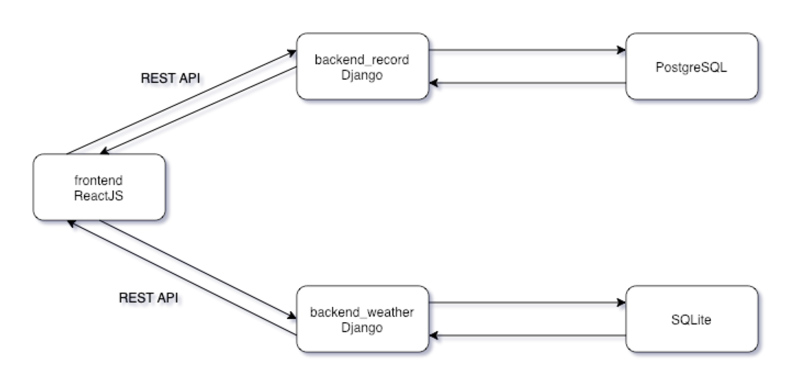
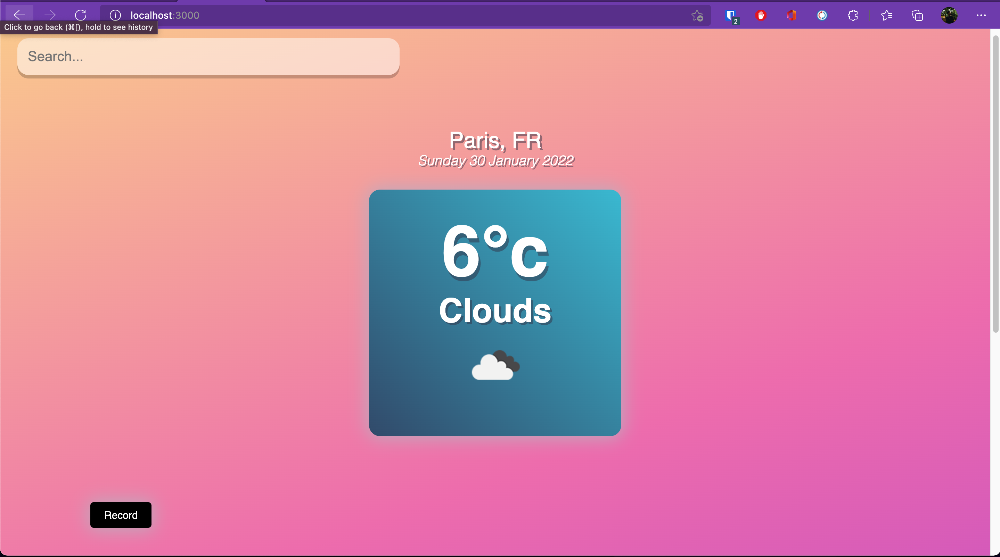
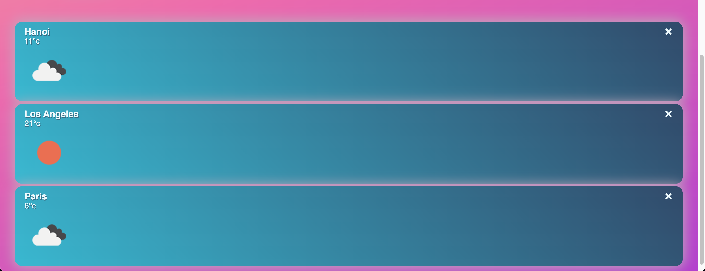
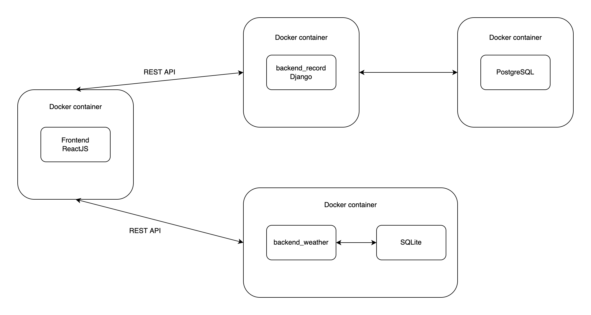

---
# pandoc report_prog_dist.md -o pdf/report_prog_dist.pdf --from markdown --template eisvogel.tex --listings --pdf-engine=xelatex --toc --number-sections

papersize: a4
lang: fr-FR
# geometry:
#     - top=30mm
#     - left=20mm
#     - right=20mm
#     - heightrounded
documentclass: article
title: Rapport projet du module Programmation distiribuée
author: LAI Khang Duy - Lylia DJALI
date: 29-01-2022
titlepage: true
toc-own-page: true
lof: true
lof-own-page: true
titlepage-logo: assets/images/uparis.png
header-includes: 
      - |
        ``` {=latex}
        \let\originAlParaGraph\paragraph
        \renewcommand{\paragraph}[1]{\originAlParaGraph{#1} \hfill}
        ```
...

# Bonus work Qwiklabs
Please find the link here 

- [LAI KHANG DUY](https://www.qwiklabs.com/public_profiles/b3802779-0893-4f19-a16a-f7e5309c3219)

- [LYLIA DJALI](https://www.qwiklabs.com/public_profiles/d8f6c6b9-ecc2-44ae-8bda-78e65fc5874b)

# Ressources :
Le code source est disponisble dans le lien ci-dessous. 

[**CLICK HERE**](https://github.com/laiduy98/project_programation_distribuee)

# Présentation du projet
Le but de ce projet est de montrer le concept d'utilisation de plusieurs technologies pour la programmation distribuée. Avec ce projet, nous avons construit un serveur web complet avec 2 backends, 1 frontend et 1 base de données pour démontrer les problèmes. 

L'application a 2 fonctionnalités principales. 
1. Rechercher et afficher la météo et la température de l'endroit que l'utilisateur saisit.
2. Lorsque l'utilisateur clique sur record, l'application enregistre les données dans la base de données et les affiche la prochaine fois que l'utilisateur visite le site Web.




Chacun service est placé dans un conteneur Docker , à l'aide de Docker Compose on définit la communication entre chaque service.

Le front-end récupère les données de 2 backends avec 2 tâches indépendantes, nous avons donc déployé le concept de microservices.

Notre projet consiste à réaliser une application web tout en utilisant les technologies acquises lors du cours Programmation distribuée.

Et pour cela nous avons créé une application qui affiche la température pour n’importe quelle ville au monde ainsi qu’un enregistrement des températures précédentes récupéré depuis la base de données.


# Introduction technologies utilisées :

## Django
Django est un framework web Python de haut niveau qui encourage le développement rapide et une conception propre et pragmatique. Conçu par des développeurs expérimentés, il prend en charge une grande partie des problèmes liés au développement Web, ce qui nous a permi  de nous concentrer sur la création de notre application sans avoir à réinventer la roue. Il est gratuit et open source

## React.JS
ReactJS est une bibliothèque JavaScript frontale gratuite et open-source permettant de créer des interfaces utilisateur basées sur des composants UI. Elle est maintenue par Facebook et une communauté de développeurs individuels et d'entreprises. Il s'agit du cadre frontal le plus courant pour la création d'applications Web à l'heure actuelle.

## PostgreSQL
PostgreSQL est un système de gestion de base de données relationnelle (SGBDR) libre et gratuit qui met l'accent sur l'extensibilité et la conformité SQL. La raison pour laquelle nous avons choisi Postgres plutôt que d'autres bases de données est qu'il est entièrement intégré à Django. De plus, l'image officielle de PostgreSQL sur Dockerhub est très facile à déployer sans grande modification.

# Fonctionnalités

- Recherchez le lieu et appuyez sur Entrée pour obtenir la météo et la température.


- Enregistrez la recherche dans la base de données.


- Supprimer la recherche de la base de données.


# Architecture de l’application
Pour expliquer le fonctionnement de notre application web, nous avons schématisé l’architecture logicielle de notre application comme on peut le voir sur la figure ci-dessous:


```
->project_final/
  ->backend_record/
  ->backend_weather/
  ->frontend/
  ->.gitignore
  ->docker_compose.yml
```


Notre application web utilisant le web service REST est composé de :

1. Un front end (qui nous sert de navigateur) codé en ReactJS.

Ceci va prendre les données de backend_weather et backend_record et les afficher à l'écran pour l'utilisateur

2. Deux back end (qui nous sert de navigateur) codé en Python.

- Un qui sert à récupérer la température d’une autre API codé en python en utilisant Django (backend_weather). 



- Le deuxième qui sert à stocker et à extraire les données depuis notre base donnée codé en python en utilisant Django (backend_record).



 Le backend_record va prendre l'enregistrement du moment où l'utilisateur clique sur le bouton d'enregistrement et l'écrire dans PostgreSQL.

 Le SQLite de backend_weather est exécuté dans le même conteneur que backend_weather pour gérer la tâche d'administration uniquement.

# Technologies de programmation distibuée utilisés dans ce projet 

## Docker
Les conteneurs fonctionnent un peu comme les VM, mais de manière beaucoup plus spécifique et granulaire. Ils isolent une seule application et ses dépendances - toutes les bibliothèques logicielles externes dont l'application a besoin pour fonctionner - à la fois du système d'exploitation sous-jacent et des autres conteneurs.
	
Dans notre application chaque application tourne et contenue dans un docker container,
Ce qui permet une utilisation plus efficace des ressources du système, des cycles de livraison de logiciels plus rapides, mais surtout très efficace dans architecture micro-service telle que la nôtre.



chacun des services définis par un Dockerfile qui se trouve dans le dossier repository.


```
FROM python:3
ENV PYTHONUNBUFFERED 1

# COPY . /usr/src/app
WORKDIR /usr/src/app
COPY requirements.txt ./
RUN pip install -r requirements.txt


COPY . ./
RUN ["python", "manage.py", "makemigrations" ]
EXPOSE 8001
```
Exemple d'un Dockerfile des services Django

## Docker compose
Compose est un outil permettant de définir et d'exécuter des applications Docker multi-conteneurs. Avec Compose, on utilise un fichier YAML pour configurer les services de votre application. Ensuite, avec une seule commande, on crée et démarre tous les services à partir de notre configuration. 

```
version: '3'

services:
  db:
    image: postgres
    ports:
      - "5432:5432"
    environment:
      - POSTGRES_USER=docker
      - POSTGRES_PASSWORD=Docker_123
      - POSTGRES_DB=my_db


  django-backend-record-service:
    build: ./backend_record/
    volumes:
      - ./backend_record:/usr/src/app
    ports:
      - 8001:8001
    command: python manage.py runserver 0.0.0.0:8001
    depends_on:
      - db


  django-record-weather-service:
    build: ./backend_weather/
    volumes:
      - ./backend_weather:/usr/src/app
    ports:
      - 8000:8000
    command: python manage.py runserver 0.0.0.0:8000


  react:
    restart: always
    command : npm start
    build:
      context: ./frontend/
      dockerfile: Dockerfile
    tty: true
    ports:
      - "3000:3000"
    stdin_open: true
    depends_on:
      - django-backend-record-service
      - django-record-weather-service
```

Comme vous pouvez le voir, nous avons 4 services définis dans le fichier docker compose.

Le port de chaque service est exposé afin que nous puissions vérifier.

## Microservice
L'application a 2 backends. Ainsi, si 1 service est en panne, l'autre service fonctionne toujours.


## Kubernetes
Minikube est un outil qui nous permet d'exécuter Kubernetes localement. minikube exécute un cluster Kubernetes à un seul nœud sur notre ordinateur.
Dans notre cas , comme on a utilisé minikube , tous nos conteneurs sont orchestrés par un  seul node.

On utilise Kompose pour traduire le docker_compose.yml vers un Kurbernetes resources.

```
kompose convert -f docker-compose.yaml

kubectl apply -f .

kubectl get po
```


# Conclusion
Ce projet nous a initié aux notions Docker ainsi que Kubernetes d’ou Docker aide à "créer" des conteneurs, et Kubernetes permet de les "gérer" au moment de l'exécution. Utiliser Docker pour emballer et expédier l'application et utiliser Kubernetes pour déployer et mettre à l'échelle l’application.
Utilisés ensemble, Docker et Kubernetes servent de facilitateurs de la transformation numérique et d'outils pour une architecture cloud moderne.
